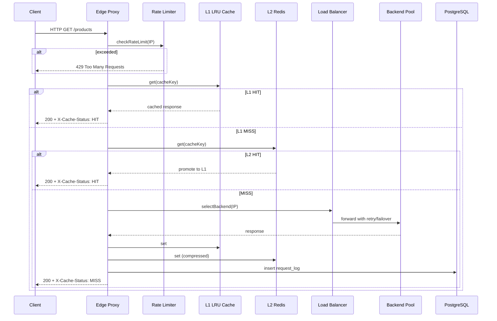

# EdgeFlow Architecture

Distributed Edge Proxy & Intelligent Caching Infrastructure — system design reference.

## High-Level Topology

```
                    ┌─────────────────────────────────────┐
                    │     Observability Dashboard         │
                    │  (Next.js + WebSocket + Recharts)   │
                    └──────────────┬──────────────────────┘
                                   │ ws://:8080/ws/metrics
                                   ▼
┌──────────┐              ┌───────────────────────────────────────┐
│  Client  │──HTTP───────▶│         Edge Proxy (:8080)            │
│ (Browser │              │  Rate Limit → Cache → LB → Retry      │
│  / Load) │◀─────────────│  Compression → Metrics → Logging      │
└──────────┘              └───────┬───────────────┬───────────────┘
                                  │               │
                    ┌─────────────┼───────────────┼─────────────┐
                    ▼             ▼               ▼             ▼
              Backend A     Backend B       Backend C      Redis (L2)
              :3001         :3002           :3003          Rate limits
                    │             │               │             │
                    └─────────────┴───────────────┴─────────────┘
                                              │
                                              ▼
                                    PostgreSQL (metrics/logs)
```

## Request Lifecycle



## Cache Flow (Two Layers)

```
Request ──▶ buildCacheKey(SHA256)
                │
                ▼
         ┌──────────────┐
         │  L1 LRU RAM  │  TTL + LRU eviction
         └──────┬───────┘
                │ miss
                ▼
         ┌──────────────┐
         │ Redis L2     │  gzip-compressed payloads
         └──────┬───────┘
                │ miss
                ▼
         Origin fetch ──▶ populate L1 + L2

Stale-While-Revalidate:
  - Serve stale entry immediately
  - Background refresh to origin
```

## Load Balancing Flow

```
                    ┌─────────────────┐
                    │ Algorithm Select │
                    └────────┬────────┘
                             │
     ┌───────────┬───────────┼───────────┬───────────┐
     ▼           ▼           ▼           ▼           │
 Round Robin  Weighted RR  Least Conn  IP Hash      │
     │           │           │           │           │
     └───────────┴───────────┴───────────┘           │
                             │                         │
                             ▼                         │
                    Healthy Backend Pool               │
                    (unhealthy removed)                │
                             │                         │
                             ▼                         │
                    Active connection ++               │
```

Algorithms are switchable at runtime via `POST /api/admin/load-balancer`.

## Failover & Retry Flow

```
Attempt 1 ──▶ Backend A ──▶ 500/timeout
    │              │
    │              └── mark unhealthy, backoff
    ▼
Attempt 2 ──▶ Backend B (exclude A) ──▶ success
    │
    └── log failover_logs + metrics
```

- Exponential backoff between attempts
- Configurable `MAX_RETRIES`
- Automatic backend exclusion on failure
- Health monitor re-admits recovered backends

## Health Monitoring Flow

```
Every 5 seconds:
  FOR each backend:
    GET /health (3s timeout)
    IF healthy → markHealthy, record responseTime
    ELSE → markUnhealthy, remove from LB pool
    INSERT backend_metrics → PostgreSQL
```

## WebSocket Metrics Flow

```
MetricsCollector (in-memory aggregates)
        │
        ▼ every 1s
WebSocket /ws/metrics
        │
        ▼
Dashboard (live charts, no refresh)
```

Streamed fields: RPS, latency, cache ratio, backend health, retries, failovers, compression stats, Redis info, memory.

## Rate Limiting Flow

```
Client IP ──▶ Redis key edgeflow:rl:{ip}
                │
    ┌───────────┼───────────┐
    ▼           ▼           ▼
Fixed Window Sliding   Token Bucket (default)
    │           │           │
    └───────────┴───────────┘
                │
         allowed? ──no──▶ 429 + Retry-After
```

Default: **100 requests/minute/IP** via token bucket.

## Data Stores

| Store      | Purpose                                      |
|-----------|-----------------------------------------------|
| L1 LRU    | Hot path, sub-ms cache reads                  |
| Redis     | Distributed L2 cache + rate limit counters    |
| PostgreSQL| request_logs, backend_metrics, traffic_metrics, failover_logs |

## Compression Layer

Responses above `COMPRESSION_MIN_BYTES` are compressed with **brotli** (preferred) or **gzip** based on `Accept-Encoding`. Savings tracked in metrics for dashboard bandwidth charts.
